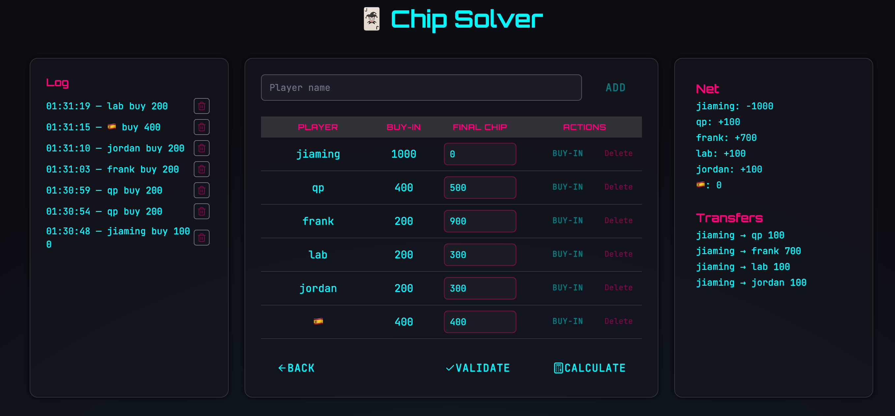

# 🃏 Chip Solver for Texas Hold'em


This tool was designed for in-person poker home games with friends.
Just track who bought in and how much they cashed out. We’ll handle the rest —
including figuring out who owes whom, and how much.


## 🎯 Features

- 💸 Add players and record buy-ins
- 🧾 Dynamic event log with undo
- 🧮 Settle phase: enter final chip counts and validate
- 📊 Instantly calculate who owes whom

## 📦 Tech Stack

- [Vite](https://vitejs.dev/) + [React](https://react.dev/)
- [TypeScript](https://www.typescriptlang.org/)
- [Tailwind CSS](https://tailwindcss.com/)
- Deployed via **GitHub Pages** or **Vercel**

## 🚀 Getting Started

```bash
# Install dependencies
npm install

# Start dev server
npm run dev

🛠 Build & Deploy

# Build
npm run build

# Deploy to GitHub Pages
npm run deploy

If deploying to GitHub Pages, update vite.config.ts:

base: '/your-repo-name/'
